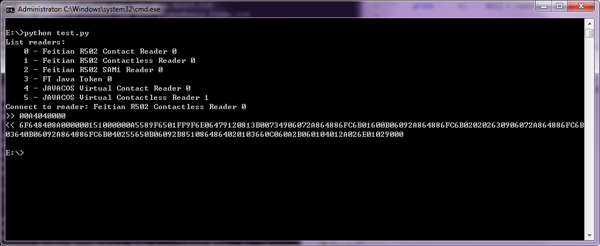
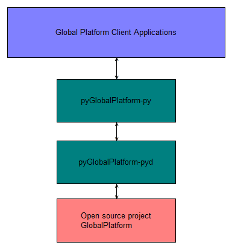

# pyGlobalPlatform
pyGlobalPlatform is a open source python **globalplatform** client library. It is depend on the [GlobalPlatform](http://sourceforge.net/projects/globalplatform/) project. Using this library, you can use all features of GlobalPlatform project use Python programming language.

# Dependencies
[GlobalPlatform](http://sourceforge.net/projects/globalplatform/)
## Files used when building
- globalplatform.h

	Header file of opensource globalplatform library.
- globalplatform.lib

	The library file of opensource globalplatform library.

## Files used when run
- globalplatform.dll

	The dll of opensource globalplatform library.
- libeay32.dll/ssleay32.dll/zlib1.dll

	Dlls globalplatform.dll used.
- GPPcScConnectionPlugin.dll

	Dll globalplatform.dll used in runtime.

###Note:
    1. The dll files shall be in the BIN path when globalplatform.dll functions is called.
    2. You can download the header/library files and dll files from http://javacardos.com/javacardforum/viewforum.php?f=41.

# Usage:

For more api usage examples, please visit [pyGlobalPlatform Developer's Guide](http://javacardos.com/javacardforum/viewforum.php?f=41)

# Structure

- **Opensource project [GlobalPlatform](http://sourceforge.net/projects/globalplatform/)**: The implementation of GlobalPlatform functions.
- **pyGlobalPlatform-pyd**: python->C convert.
- **pyGlobalPlatform-py**: Define python API prototype, constants.
- **GlobalPlatform Client Applications**: Implemention of some GP tools using python programming language.

# Build

Provide cmake script, this project can be compiled for use on both windows and linux platform. For more details, please visit our forum [JavacardOS pyGlobalPlatform Discussions](http://javacardos.com/javacardforum/viewforum.php?f=41).

# Developer's Guide
Introduce the usage of library APIs. Visit: [pyGlobalPlatform Developer's Guide](http://javacardos.com/javacardforum/viewforum.php?f=41)
# Discussions
If you have any questions, please visit: [JavacardOS pyGlobalPlatform Discussions](http://javacardos.com/javacardforum/viewforum.php?f=41)

# Website
[JavacardOS](http://www.javacardos.com)
